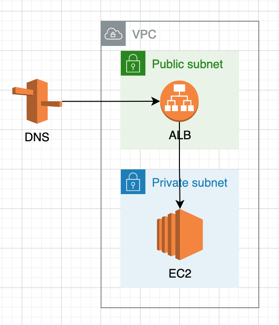

# DIP Airbyte POC

## Overview

This repo contains the infrastructure to host Airbyte with basic HTTP Authentication using Nginx Reverse Proxy.

## Prerequisites

This infrastructure assumes you have already created a Route 53 Hosted Zone with a ACM certification for that domain. If you have not:

1. register a domain on Route 53
2. register a cert for both `www.<domain>.com` and `<domain>.com` via AWS Certificate Manager
3. create CNAME records according to your certs on your hosted zone
4. create 2 A records for both `www.<domain>.com` and `<domain>.com` pointing to your ALB after configuring Airbyte according to this repo

This infrastructure also assumes that you have configured a vpc with at least 2 public and private subnets. If you have not done so, configure [the following infrastructure](https://github.com/sethsaperstein/poc-network-tf) first.

## More Details

### ALB
- Listens on port 443 using HTTPS and forwards traffic to port 80 on the EC2

### EC2
- Runs an nginx docker container on airbyte's docker network that forwards host traffic from port 80 to container port 8080 
- Uses nginx to listen to port 8080 on the container, check credentials against a basic auth file, and forward to `http://webapp:80/`, the airbyte web app container
- Runs multiple airbyte containers per its [docker-compose file](https://github.com/airbytehq/airbyte/blob/master/docker-compose.yaml)